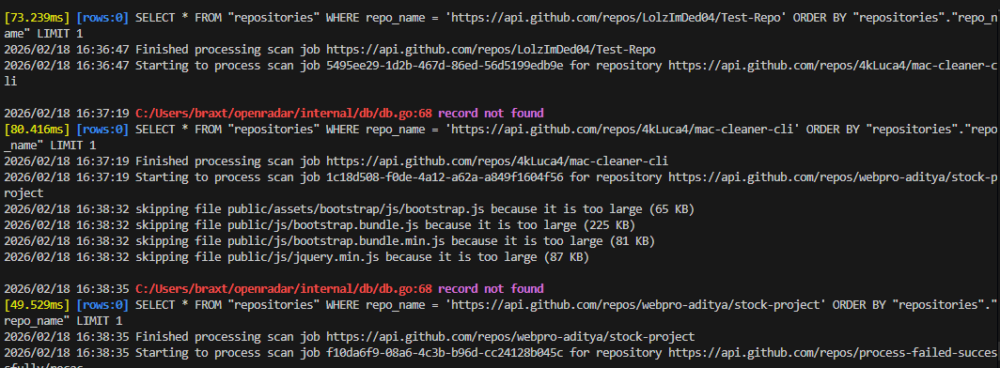
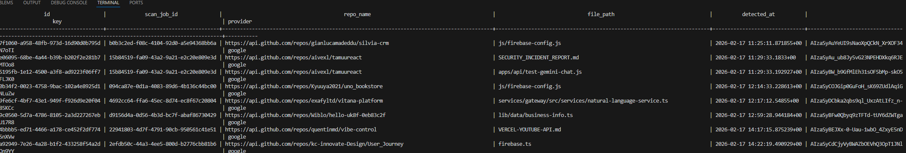

<p align="center">
  OpenRadar
</p>
<p align="center">
  
</p>
<p align="center">
  GitHub leak scanning tool
</p>


## What is OpenRadar
> OpenRadar is a tool designed to find leaked Github credentials that are pushed to repositories.

## How does OpenRadar work?
> OpenRadar scans Github endpoints for new repositories/commits and scans them for credentials

## Screenshots





## Self-hosting
You must have the following requirements:
```
Golang 1.26
NodeJs 22.20.0
Postgres DB
```

### Cloning & Install prerequsites

> Start by cloning the repository

`git clone https://github.com/officialmelon/openradar.git`

> Navigate into the directory

`cd openradar`

> Navigate into the app directory

`cd app`

> Install the required libraries

`npm install`

> Navigate back out of the directory

`cd ..`

> Now install the Go packages!

`go mod download`

### Now setup your .env file

Clone the .env file and add your postgress DB!

Next add your GitHub token, which you can get by visting your Developer Settings

Enter those in the respective areas (`DATABASE_URL` & `GITHUB_TOKEN`)

### Starting the server

`go run cmd\server\main.go`

Now you can access the server on your [localhost port 8080](http://localhost:8080) (or your custom port if specified)!

## APIs

### `GET /findings`
Returns a paginated list of all findings.
- **Query Parameters:**
  - `page` (integer, default: 1): The page number to retrieve.
  - `page_size` (integer, default: 25, max: 100): The number of items per page.
  - `provider` (string, default: "*"): Filter findings by a specific provider (e.g., `openai`, `google`). `*` returns all.
  - `min_age` (string, default: "24h"): The minimum age of findings to return (e.g., `1h`, `7d`).

- **Response Body:**
  ```json
  {
    "findings": [
      {
        "id": "c2a7a5a8-4a1b-4b3a-8b1e-7b3a2a1b3d4e",
        "scan_job_id": "sjb_...-lts",
        "repo_name": "https://api.github.com/repos/user/repo",
        "file_path": "src/config.js",
        "detected_at": "2026-02-18T15:41:51Z",
        "key": "sk_...",
        "provider": "openai"
      }
    ],
    "page": 1,
    "page_size": 25,
    "total_count": 1,
    "total_pages": 1
  }
  ```

### `GET /findings/count`
Returns the total number of findings.

- **Response Body:**
  ```json
  {
    "total_count": 12345
  }
  ```

### `GET /repository`
Returns information about a specific repository.
- **Query Parameters:**
  - `repo_url` (string, required): The full API URL of the repository (e.g., `https://api.github.com/repos/user/repo`).

- **Response Body:**
  ```json
  {
    "scan_job_id": "sjb_...-lts",
    "repo_name": "https://api.github.com/repos/user/repo",
    "last_updated": "2026-02-18T15:41:51Z"
  }
  ```

### `GET /repository/findings`
Returns a paginated list of findings for a specific repository.
- **Query Parameters:**
  - `repo_url` (string, required): The full API URL of the repository.
  - `page` (integer, default: 1): The page number to retrieve.
  - `page_size` (integer, default: 25, max: 100): The number of items per page.

- **Response Body:** (Same structure as `GET /findings`)
  ```json
  {
    "findings": [
      {
        "id": "c2a7a5a8-4a1b-4b3a-8b1e-7b3a2a1b3d4e",
        "scan_job_id": "sjb_...-lts",
        "repo_name": "https://api.github.com/repos/user/repo",
        "file_path": "src/config.js",
        "detected_at": "2026-02-18T15:41:51Z",
        "key": "sk_...",
        "provider": "openai"
      }
    ],
    "page": 1,
    "page_size": 25,
    "total_count": 1,
    "total_pages": 1
  }
  ```

### `GET /repositories`
Returns a paginated list of all scanned repositories.
- **Query Parameters:**
  - `page` (integer, default: 1): The page number to retrieve.
  - `page_size` (integer, default: 25, max: 100): The number of items per page.

- **Response Body:**
  ```json
  {
    "repositories": [
        {
            "scan_job_id": "sjb_...-lts",
            "repo_name": "https://api.github.com/repos/user/repo",
            "last_updated": "2026-02-18T15:41:51Z"
        }
    ],
    "page": 1,
    "page_size": 25,
    "total_count": 1,
    "total_pages": 1
  }
  ```

## Stack

`Golang + Vite`

## Credits
@officialmelon (me!)

I got this idea off a *non-open* sourced site (https://apiradar.live)